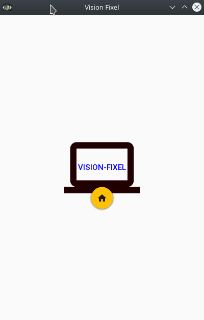
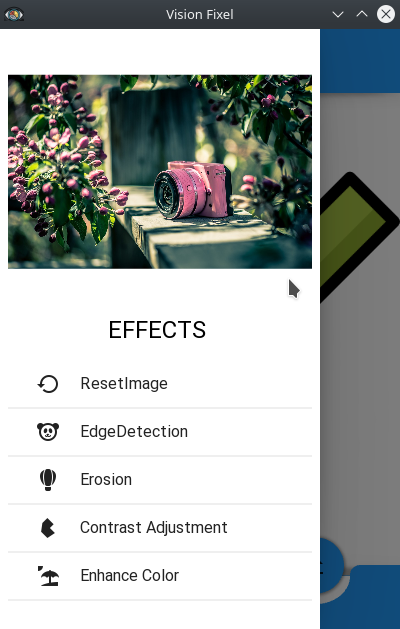
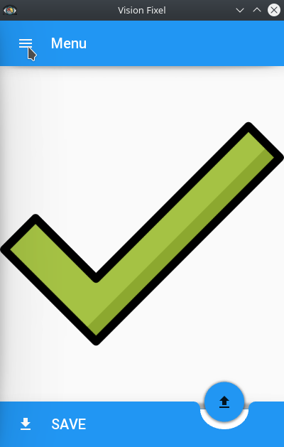
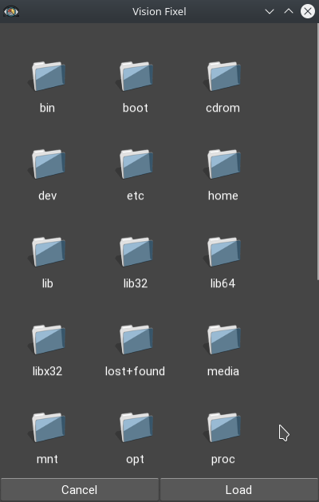

# Vision-Fixel

 

**_Official Repository of [Mini Project-II](https://github.com/Er-Rakesh-Yadav/Vision-Fixel)_**
 

<table>
<tr>
<td></td>
<td></td>
</tr>
</table>

## Pre-Requisite

- KivyMD 
- Opencv-python
- Numpy
- Buildozer
  

- **_HARDWARE_**
    - Windows(Version 7+)
    - Android (Version 2.2+)
    - Linux(Ubuntu/Kubuntu/Fedora/...)
    - RAM 2GB
    
- **_SOFTWARE_**
    - Python 3.7 / Python 3.8
    - Pycharm / VS-Code
  

### Contributors
- [**RAKESH YADAV**](https://github.com/Er-Rakesh-Yadav)
- [**PRAGYA SHARMA**](https://github.com/pragya-sharma)
- [**SHIVAM YADAV**](https://github.com/shivamyadav37)

### Mentor
- [**Prof. Vinay Agrawal**](https://github.com/vinayagrawal40)

 
<table>
  <h2>Screenshots</h2>
  

<tr>
<td></td>
<td></td>
</tr>
<tr>
<td></td>
<td></td>
</tr>
</table>

